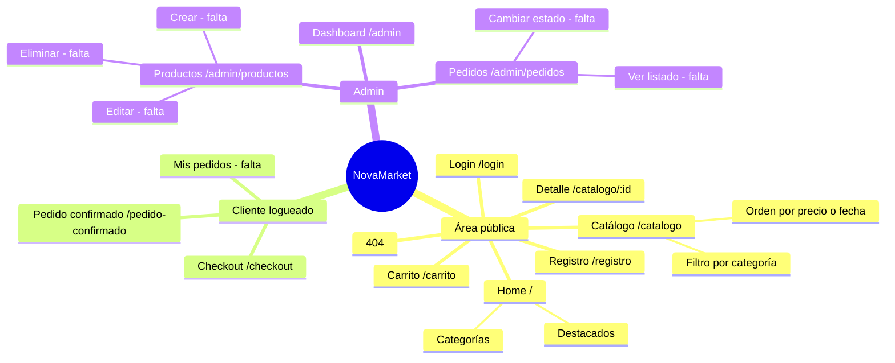
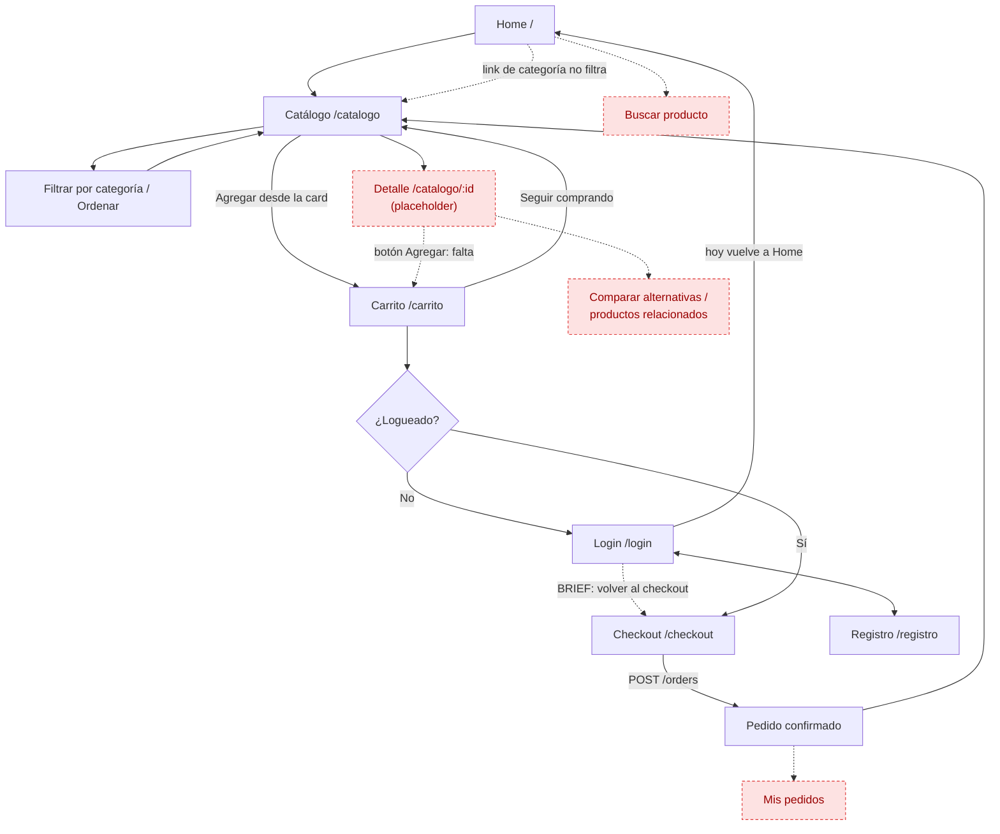
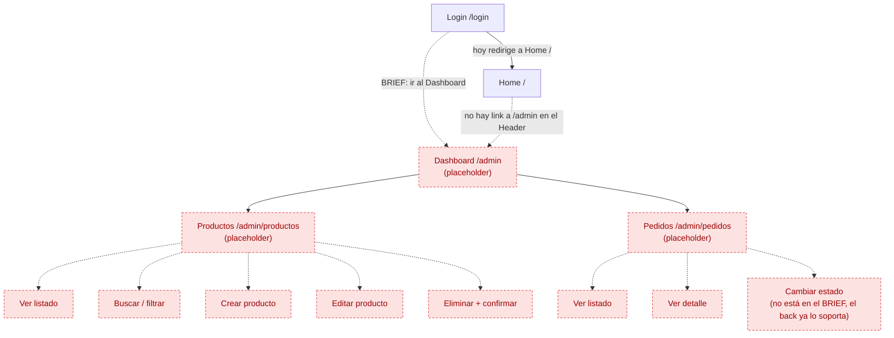

# Mapa de vistas y componentes — Frontend NovaMarket

**Autor:** Gaston Paniagua (Frontend) · **Sprint:** Semana 1 · **Fecha:** 25/sep/2026
**Base:** código real de `frontend/src` en `develop` (commit `bad32c9`) + user flow de `BRIEF.md`.

> Este documento describe **lo que hay hoy** en el código y marca lo que falta. No propone scope nuevo.
> Estados: ✅ completa · 🟡 parcial · ⬜ placeholder

---

## 1. Páginas

Todas las rutas públicas y de cliente se renderizan dentro de `Layout` (Header + Footer). Las de admin usan `AdminLayout` (sidebar propio, sin Header/Footer).

| Página | Ruta | Acceso | Qué muestra | Componentes que usa | Endpoints | Estado |
|---|---|---|---|---|---|---|
| `HomePage` | `/` | Pública | Hero, grilla de 8 categorías, 4 productos destacados con "Agregar" | `Layout` · tarjeta de producto y de categoría **inline** | `GET /products?order=newest` | 🟡 Los links de categoría (`?categoria=`) no filtran el catálogo; badge "En stock" fijo aunque no haya stock |
| `CatalogPage` | `/catalogo` | Pública | Sidebar de filtros (categoría + orden), grilla de productos, contador | `Layout` · tarjeta de producto y filtros **inline** | `GET /products?category=&order=` | 🟡 Funciona con loading/error/empty. No lee query params de la URL, falta "Iluminación" en los filtros, no hay búsqueda |
| `ProductDetailPage` | `/catalogo/:id` | Pública | Solo el texto "Cargando producto #id..." | `Layout` | Ninguno (debería usar `GET /products/:id`) | ⬜ |
| `CartPage` | `/carrito` | Pública | Ítems con +/−/eliminar, resumen, total, "Vaciar", "Seguir comprando"; empty state | `Layout` · ítem y resumen **inline** | Ninguno (usa `CartContext`) | 🟡 Sin límite de stock; imagen usa `image_url` y no `getProductImage()`; sin login va a `/login` y no vuelve |
| `LoginPage` | `/login` | Pública | Form email + contraseña, error, link a registro | `Layout` · inputs **inline** | `POST /auth/login` | 🟡 Siempre redirige a `/` (ni al checkout ni a `/admin`) |
| `RegisterPage` | `/registro` | Pública | Form nombre + email + contraseña | `Layout` · inputs **inline** | `POST /auth/register` | 🟡 Siempre redirige a `/`; no valida mínimo 8 caracteres en el front (lo valida el back) |
| `CheckoutPage` | `/checkout` | Requiere login | Form de envío (nombre, dirección, ciudad, teléfono, notas) + resumen + "Confirmar pedido" | `Layout` · resumen **inline** | `POST /orders` | 🟡 Funciona, pero grilla fija `1fr 360px` (se rompe en 375px) y llama a `navigate()` durante el render si el carrito está vacío |
| `OrderConfirmedPage` | `/pedido-confirmado` | Requiere login | Nº de pedido, estado, dirección, total | `Layout` | Ninguno (lee `location.state`) | 🟡 Si se recarga la página, se pierde el resumen; estado "Pendiente" hardcodeado |
| `DashboardPage` | `/admin` | Solo admin | 2 tarjetas con "—" | `AdminLayout` | Ninguno | ⬜ |
| `ProductsAdminPage` | `/admin/productos` | Solo admin | Tabla vacía "Cargando productos..." + botón "Nuevo producto" sin acción | `AdminLayout` | Ninguno (existen en `api.js`: `getAllAdmin`, `create`, `update`, `remove`) | ⬜ |
| `OrdersAdminPage` | `/admin/pedidos` | Solo admin | Tabla vacía "Cargando pedidos..." | `AdminLayout` | Ninguno (existen en `api.js`: `ordersAPI.getAllAdmin`, `updateStatus`) | ⬜ |
| `NotFoundPage` | `*` | Pública | 404 con efecto glitch, terminal fake, volver | — (sin `Layout`) | Ninguno | ✅ |
| _Mis pedidos_ | — (el Footer linkea a `/mis-pedidos`) | Requiere login | — | — | `GET /orders`, `GET /orders/:id` (ya existen en back y en `api.js`) | ❌ No existe |

**Rutas reales vs. nombres del ticket:** Home `/` · Login `/login` · Registro `/registro` · Catálogo `/catalogo` · Detalle `/catalogo/:id` · Carrito `/carrito` · Checkout `/checkout` · Panel Admin `/admin`, `/admin/productos`, `/admin/pedidos`.

### Endpoints reales que consume el front (`services/api.js`)

| Función | Método y ruta |
|---|---|
| `authAPI.register / login / me` | `POST /auth/register` · `POST /auth/login` · `GET /auth/me` |
| `productsAPI.getAll / getById` | `GET /products` (`category`, `order`, `minPrice`, `maxPrice`) · `GET /products/:id` |
| `productsAPI.getAllAdmin / create / update / remove` | `GET /products/admin/all` · `POST /products/admin` · `PUT /products/admin/:id` · `DELETE /products/admin/:id` (soft delete) |
| `ordersAPI.create / getAll / getById` | `POST /orders` · `GET /orders` (mis pedidos) · `GET /orders/:id` |
| `ordersAPI.getAllAdmin / updateStatus` | `GET /orders/admin/all` · `PATCH /orders/admin/:id/status` |
| `checkHealth` | `GET /health` |

---

## 2. Componentes reutilizables

### 2.1 Existentes

| Componente | Archivo | Props | Qué hace |
|---|---|---|---|
| `Layout` | `components/layout/Layout.jsx` | — (usa `<Outlet />`) | Header + `<main>` + Footer para rutas públicas/cliente |
| `Header` | `components/layout/Header.jsx` | — (lee `useCart`, `useAuth`) | Cumple el rol de **Navbar**. Logo, nav (Inicio, Catálogo), `ThemeToggle`, carrito con badge, nombre + "Salir" / "Ingresar", menú hamburguesa mobile |
| `Footer` | `components/layout/Footer.jsx` | — | Marca, redes, links Tienda/Empresa/Legal, medios de pago |
| `ProtectedRoute` | `components/ui/ProtectedRoute.jsx` | — | Si no hay usuario → `/login` |
| `AdminRoute` | `components/ui/ProtectedRoute.jsx` | — | Sin usuario → `/login`; no admin → `/` |
| `ThemeToggle` | `components/ui/ThemeToggle.jsx` | — (lee `useTheme`) | Botón sol/luna, alterna claro/oscuro |
| `AdminLayout` | `pages/admin/AdminLayout.jsx` | — (usa `<Outlet />`) | Sidebar (Dashboard, Productos, Pedidos) + contenido. Vive en `pages/`, convendría moverlo a `components/layout/` |

Utilidad compartida: `utils/productImage.js` → `getProductImage(product)` (imagen por nombre → por categoría → genérica).

### 2.2 Faltantes (hoy escritos inline dentro de páginas o inexistentes)

| Componente | Hoy está en… | Props principales propuestas | Prioridad |
|---|---|---|---|
| `ProductCard` | Duplicado en `HomePage` y `CatalogPage` (mismo markup `.card`) | `product`, `onAdd(product)`, `isAdded`, `showDetailLink` | Alta |
| `CartItem` | Inline en `CartPage` (todo con estilos inline) | `item`, `onIncrease`, `onDecrease`, `onRemove`, `maxQuantity` | Alta |
| `OrderSummary` | Duplicado en `CartPage` y `CheckoutPage` (`.cart-summary`) | `items`, `total`, `title`, `children` (botón de acción) | Media |
| `Button` | Clases `btn btn--*` repetidas en todas las páginas | `variant`, `size`, `full`, `loading`, `disabled`, `as` (`Link`/`button`) | Media |
| `FormField` / `Input` | Repetido en Login, Register y Checkout (`.form-group` + label + input) | `id`, `label`, `type`, `value`, `onChange`, `error`, `hint`, `required` | Media |
| `Spinner` / `Skeleton` | No existe; hoy se muestra el texto "Cargando..." | `size` / `count` | Media |
| `StateMessage` (empty / error) | Textos sueltos en Home, Catalog y Cart | `icon`, `title`, `description`, `action` | Baja |
| `CategoryFilter` | Inline en `CatalogPage` | `categories`, `value`, `onChange` | Baja |
| `Badge` (stock / estado de pedido) | Clases `badge badge--*` sueltas | `variant`, `children` | Baja |
| `Modal` | No existe (lo necesita el CRUD de admin y la confirmación de borrado) | `isOpen`, `title`, `onClose`, `children` | Alta (para S5) |
| `ProductForm` | No existe | `initialValues`, `onSubmit`, `loading` | Alta (para S5) |
| `AdminTable` | Markup de tabla repetido en Products/OrdersAdmin | `columns`, `rows`, `loading`, `emptyText` | Media |

---

## 3. Contextos globales

Orden de providers en `App.jsx`: `BrowserRouter > ThemeProvider > AuthProvider > CartProvider > Routes`.

| Contexto | Hook | Expone | Persistencia |
|---|---|---|---|
| `AuthContext` | `useAuth()` | `user`, `login(userData, token)`, `logout()`, `isAuthenticated`, `isAdmin`, `loading` | Token en `localStorage['nm-token']`; al montar llama a `GET /auth/me` para restaurar el usuario |
| `CartContext` | `useCart()` | `items`, `addItem(product, qty=1)`, `removeItem(id)`, `updateQuantity(id, qty)`, `clearCart()`, `total`, `itemCount` | `localStorage['nm-cart']` (guarda el producto completo + `quantity`) |
| `ThemeContext` | `useTheme()` | `theme` (`'light'`/`'dark'`), `toggleTheme()`, `isDark` | `localStorage['nm-theme']`, si no existe usa la preferencia del sistema |

Notas: `total` e `itemCount` se recalculan en cada render (sin `useMemo`), y las funciones no están memoizadas.

---

## 4. Mapa mental de la navegación

---

## 5. Diagramas de navegación vs. user flow del BRIEF

### 5.1 Flujo de compra (cliente)

Líneas punteadas y nodos rojos = pasos del BRIEF que hoy **no** están implementados o se comportan distinto.

**Diferencias con el BRIEF:**

| Paso del BRIEF | Situación actual |
|---|---|
| Home → "Buscar producto" | No hay buscador ni en el front ni en el back (`GET /products` no acepta `search`) |
| Catálogo → Filtrar / Ordenar | ✅ Categoría y orden. Falta filtro de precio en la UI (el back ya acepta `minPrice`/`maxPrice`) |
| Catálogo → "Comparar alternativas" | No existe |
| Detalle → imágenes, descripción, disponibilidad, relacionados, agregar | Página placeholder |
| Checkout sin login → Login/Registro → **volver al checkout** | Login y Registro redirigen siempre a `/`; el usuario pierde el flujo |
| Checkout → "Revisar datos del cliente" | Se piden datos de envío (nombre, dirección, ciudad…). Envíos están fuera de alcance → confirmar con PM qué datos pedir |
| Pedido confirmado → número/resumen | ✅, pero se pierde al recargar |

### 5.2 Flujo admin

**Diferencias con el BRIEF:** la estructura de rutas coincide (Dashboard → Productos / Pedidos), pero las tres pantallas son placeholder. Además, después del login el admin cae en Home y no hay forma de llegar a `/admin` desde la UI (hay que escribir la URL), y el `AdminLayout` no tiene "Cerrar sesión" ni "Volver a la tienda".